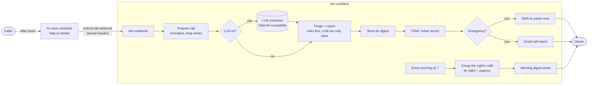

# After-Hours Call Report

[](https://github.com/birneyj1218/after-hours-call-report/actions/workflows/ci.yml)
[](https://github.com/birneyj1218/after-hours-call-report/actions/workflows/secret-scan.yml)

**Every after-hours call answered, every emergency flagged, and one clear report waiting for you in the morning.**

Your shop is closed and the phone rings at 11 pm. Instead of voicemail, an AI phone assistant answers, says it is an automated assistant, and takes a proper message: the caller's name, a callback number it reads back, the address, what is wrong, and how urgent it is. If the caller mentions something dangerous (a gas smell, a burning smell, sparks, water near the panel, no heat on a freezing night), it gives basic safety instructions and the call is marked as an emergency.

When the call ends, you get a text within seconds for the emergencies only, with the name, number, address and problem, plus a full email report. Every call, emergency or not, is logged in your CRM or ticket system. At 7 am you get one email that lists the whole night: emergencies first, then urgent calls, then the ones that can wait for business hours, each with what to do next.

Shown here for a fictional electrician, **Cavern Electrical**. All names, addresses and phone numbers in this repo are made up.

| Morning digest | One emergency call |
|---|---|
| [docs/sample-report.html](docs/sample-report.html) | [docs/sample-call-report.html](docs/sample-call-report.html) |

Both files are generated by `npm run demo` from the sample calls in [`examples/calls/`](examples/calls/). Download them and open them in a browser to see what the owner receives.

## How it works



Two parts, kept separate on purpose:

- **n8n workflow** ([`n8n/after-hours-call-report.json`](n8n/after-hours-call-report.json)) does the plumbing: one webhook in, HTTP calls out to the LLM, CRM, SMS and email APIs, and a 7 am schedule for the digest.
- **Core logic** ([`src/`](src/)) holds every decision: payload normalizing (Vapi end-of-call reports and a generic shape for other providers), the emergency classifier, summary validation, the HTML/text/SMS renderers, and digest grouping in the business's time zone. It is plain Node.js with no dependencies. The workflow's Code nodes are generated from these files, so the tested code is the code n8n runs.

Triage runs **rules first**: phrase rules over what the caller said decide the level before any LLM is involved. The LLM writes the readable summary and can raise the level, never lower it. If the LLM is down, slow, or returns something that fails validation, the owner still gets the alert and a summary built from the call data. More in [docs/architecture.md](docs/architecture.md).

## Try it locally (no accounts needed)

Requires Node.js 20 or newer. Everything runs against a mock server that stands in for the LLM, email, SMS and CRM APIs, so nothing is sent anywhere.

```bash
git clone https://github.com/birneyj1218/after-hours-call-report.git
cd after-hours-call-report
npm test        # no install step: there are no dependencies
npm run demo    # replays one night of calls, writes docs/sample-report.html
```

Demo output (fixed clock, fictional data):

```
Cavern Electrical: replaying 7 webhook deliveries (time zone America/Chicago)

  01-burning-smell-panel.vapi.json   10:15 PM  EMERGENCY Maria Okafor     -> CRM + SMS + email
                                     why: Burning smell, smoke or fire ("burning smell")
  02-no-heat-freezing.vapi.json       1:38 AM  EMERGENCY Tom Reyes        -> CRM + SMS + email
                                     why: No heat in freezing weather ("heat stopped + 6 degrees")
                                     filled from transcript by the AI: address
  03-kitchen-outlets.generic.json    11:07 PM  ROUTINE   Priya Lindqvist  -> CRM
                                     why: No emergency signs in what the caller said.
  04-breaker-tripping.vapi.json       3:13 AM  URGENT    Gus Hartley      -> CRM
                                     why: Power out ("lost power"); Breaker keeps tripping ("keeps tripping")
                                     AI summary unavailable (LLM call failed: HTTP 500); rules + call data used
  05-basement-flooding.vapi.json      5:49 AM  EMERGENCY Lena Brandt      -> CRM + SMS + email
                                     why: Flooding or water near electrical ("flooding")
                                     filled from transcript by the AI: name, callback number, address, problem
  06-status-update.vapi.json         ignored: Vapi message "status-update" is not an end-of-call report
  01-burning-smell-panel.vapi.json   duplicate delivery of call-demo-0001-burning-panel: skipped, no second alert

Morning digest at Sat, Jan 17, 7:00 AM CST: "Morning call report: 5 after-hours calls (3 emergency, 1 urgent) - Cavern Electrical" (sent to mock email API)
  Friday night, January 16: 3 emergency, 1 urgent, 1 routine

First SMS alert to the owner:

  | EMERGENCY after-hours call, Cavern Electrical
  | Fri, Jan 16, 10:15 PM CST: Maria Okafor (612) 555-0142
  | 418 Larkspur Lane, Ridgeview
  | Burning plastic smell from the breaker panel in the garage; panel door feels warm.
  | Call back now. Full report by email.
```

Call 02 shows why rules run first: the voice agent marked it "urgent", but the caller said it was 6 degrees outside with a newborn at home, so the rules raised it to an emergency. Call 04 shows the LLM failing (forced by the mock) and the alert logic carrying on without it.

### With n8n

```bash
cp .env.example .env          # defaults point at the mock server
HOST=0.0.0.0 npm run mock     # terminal 1: mock providers on :4010, reachable from the container
docker compose up -d          # n8n on http://localhost:5678
```

1. In n8n, **Workflows > Import from File** and pick `n8n/after-hours-call-report.json`.
2. Create these credentials and select them on the nodes that use them (any placeholder values work against the mock):

   | Credential name | n8n type | Used by |
   |---|---|---|
   | Voice webhook secret | Header Auth (`X-Vapi-Secret` = long random string) | the webhook |
   | LLM API key | Header Auth (`Authorization` = `Bearer <key>`) | LLM: summarize call |
   | CRM API key | Header Auth | CRM: log call |
   | Email API key | Header Auth | Email: call report, Email: morning digest |
   | SMS account (Twilio) | Basic Auth (account SID / auth token) | SMS: alert the owner |

3. Open the webhook node, change the path to a long random string, then activate the workflow.
4. Play the part of the voice provider:

```bash
VOICE_WEBHOOK_SECRET=<the value you set> node mock/send-call.js http://localhost:5678/webhook/after-hours-call/<your-path>
```

The mock prints each text, email and CRM record it receives; `curl localhost:4010/_log` shows the full bodies. To see the digest without waiting for 7 am, set the cron on **Every morning at 7** to a few minutes from now and save. (n8n keeps the stored calls only for active, production runs, so a manual test execution will not see them.)

### Going live

- **Voice assistant.** Use the prompt and structured-data schema in [docs/assistant-prompt.md](docs/assistant-prompt.md). Set the assistant's server URL to the webhook's production URL, add the secret header, and keep `end-of-call-report` in its server messages.
- **Providers.** Change the base URLs in `.env` (examples are in [`.env.example`](.env.example)) and put real keys in the n8n credentials. The email step posts `{ from, to, subject, html, text }`, which matches Resend and is close to most email APIs. The CRM step posts one JSON record per call; point it at your CRM's inbound webhook or a small adapter (see [architecture](docs/architecture.md#going-provider-agnostic)).
- **Time zone.** Set `BUSINESS_TIMEZONE` and the workflow's **Settings > Timezone** to the same zone.
- **Exposure.** Put n8n behind a TLS reverse proxy. Only the webhook path needs to be reachable from the internet.

## Configuration

All settings are environment variables read by the workflow's Config node (`$env`). Secrets are never read from env by the workflow; they live in n8n credentials.

| Variable | Default | What it does |
|---|---|---|
| `BUSINESS_NAME` | `Cavern Electrical` | Shown in every report and text |
| `BUSINESS_TIMEZONE` | `America/Chicago` | Time zone for report times and for grouping calls by night |
| `OWNER_EMAIL` | `owner@example.com` | Receives per-call reports and the morning digest |
| `REPORT_FROM_EMAIL` | `after-hours@example.com` | Sender address |
| `OWNER_SMS_NUMBER` | `+16125550100` | Receives SMS alerts; empty turns SMS off |
| `SMS_ALERT_LEVEL` | `emergency` | `emergency`, `urgent` (urgent and above) or `none` |
| `EMAIL_EACH_CALL` | `emergency` | Which calls get their own email right away: `emergency`, `urgent`, `all`, `none`. Every call is in the digest either way |
| `FREEZING_TEMP_F` | `40` | "No heat" plus a stated temperature at or below this is an emergency |
| `NIGHT_CUTOVER_HOUR` | `12` | Calls ending before this local hour count toward the previous night |
| `SEND_EMPTY_DIGEST` | `true` | Send "no after-hours calls" on quiet nights |
| `LLM_ENABLED` | `true` | `false` skips the LLM; rules and call data only |
| `LLM_BASE_URL`, `LLM_MODEL` | mock, `gpt-4o-mini` | Any OpenAI-compatible endpoint, including a local model server |
| `EMAIL_API_URL` | mock | Email API endpoint |
| `SMS_BASE_URL`, `SMS_ACCOUNT_SID`, `SMS_FROM_NUMBER` | mock | Twilio-style SMS API |
| `CRM_WEBHOOK_URL` | mock | Where each call record is posted |
| `REPORT_FOOTNOTE` | empty | Optional line at the bottom of every report |

The morning digest runs at 7:00; change the cron expression on **Every morning at 7** for a different time.

## Privacy and safety

- **Call recording and AI disclosure.** Rules on recording calls differ by state and country; some places require every party to consent. The example prompt tells callers at the start that they are talking to an automated assistant and that the call is recorded. Check what applies where you and your callers are. **This is not legal advice.**
- **Safety wording.** The assistant gives only basic "leave the building and call 911" style instructions and never repair advice. Review that wording for your trade before going live. The assistant is not an emergency service, and callers in danger should always call 911.
- **Owner texts.** SMS goes to the owner's own number, but US business texting still needs A2P 10DLC registration with your SMS provider, or carriers may block it.
- **Data retention.** Call transcripts and recordings are personal data. The workflow does not keep successful executions in n8n (`saveDataSuccessExecution: none`), the digest store keeps no transcripts and drops calls once they are reported, and seen call ids are forgotten after 7 days. Failed executions are kept for debugging and can contain call data; prune them on a schedule. Decide how long your CRM, email and voice provider keep transcripts and recordings, and set their retention to match.
- **Untrusted input.** Transcripts are treated as data: every value is HTML-escaped in reports, only `http(s)` links are rendered, the LLM prompt fences the transcript, and the LLM cannot send anything or lower the urgency on its own.

See [SECURITY.md](SECURITY.md) for how secrets are handled.

## Limitations

- **Phrase rules are not understanding.** They catch the common ways people describe danger in English and skip simple negations ("no smoke"). They will miss unusual phrasing and a caller who only answers "yes" to the assistant's question; that is where the LLM and the voice agent's own urgency field help. Tune the rules in `src/classify.js` for your trade.
- **The digest store is n8n workflow static data.** It is saved only for active (production) runs, and two calls finishing at the exact same moment can overwrite each other's update, so one could be missing from the digest (its SMS, email and CRM record are unaffected). For higher volume, read the night's calls back from your CRM or a database instead.
- **The n8n workflow is generated and simulated, not run in CI.** Tests execute the workflow's Code nodes, IF branches and expressions in a small n8n simulator with fake providers. Importing it into a real n8n is a manual step.
- **Vapi plus one generic shape.** Other voice platforms need a mapping in `src/normalize.js` or a small step that converts their webhook to the generic shape.
- **US-centric phone handling.** Ten-digit numbers are treated as US/Canada.
- **Recordings are linked, not stored.** Provider recording links can expire; copy the file to your own storage if you need to keep it.
- **The mock LLM is canned.** The sample summaries in `mock/llm-replies.json` were written for the demo; they are not output from a real model.

## Project layout

```
n8n/after-hours-call-report.json   importable n8n workflow (generated)
src/normalize.js                   Vapi end-of-call report + generic payload -> call record
src/classify.js                    rules-first emergency classifier, merge with agent/LLM
src/schema.js, src/llm.js          summary schema, validator, LLM request and parsing
src/report.js                      HTML email, plain text, SMS
src/digest.js                      morning digest grouping and rendering, workflow state
src/pipeline.js                    prepareCall / finishCall, used by n8n, demo and tests
src/adapters.js                    HTTP calls for running without n8n
mock/                              fake LLM/email/SMS/CRM server, fake voice provider
scripts/                           build-workflow.js, demo.js, check-secrets.sh
docs/                              architecture, voice prompt, sample transcripts and reports
examples/calls/                    fictional webhook payloads
test/                              node:test suites and the n8n simulator
```

## License

MIT. See [LICENSE](LICENSE). All business names, people, addresses and phone numbers in this repo are fictional (phone numbers use the reserved 555-01xx range).

---

Built by Jim Birney · [evolvaiagents.com](https://evolvaiagents.com) · [GitHub](https://github.com/birneyj1218) · [Watch the after-hours call demo](https://evolvaiagents.com/review/after-hours-call-report-demo.mp4)
